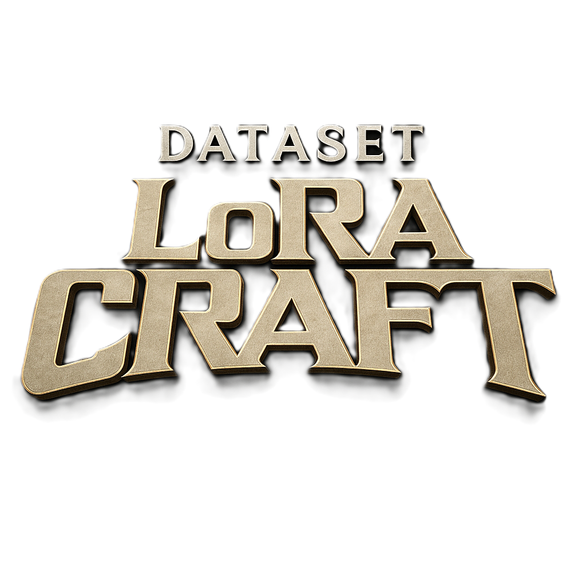

# LoRA Craft

<p align="center">
  
</p>

<p align="center">
  <strong>A professional desktop application for building high-quality LoRA training datasets</strong>
</p>

<p align="center">
  <a href="#features">Features</a> •
  <a href="#installation">Installation</a> •
  <a href="#search-engine-integrations">Search Engines</a> •
  <a href="#privacy--ethics">Privacy & Ethics</a> •
  <a href="#license">License</a>
</p>

---

## Overview

LoRA Craft is an end-to-end dataset builder designed for training LoRA (Low-Rank Adaptation) image models for systems like Flux and SDXL. The application provides a complete workflow for collecting, organizing, cleaning, and preparing image datasets, then exporting them for model training or pushing them directly to Replicate.com for training.

The application follows a workspace-based organization where users create workspaces (called "Concepts") containing multiple datasets. Each dataset consists of images with associated metadata (captions, tags, aspect ratios) that can be cleaned, deduplicated, and prepared according to LoRA training best practices.

## Features

- **Multi-Engine Web Image Search**: Search for images across multiple search engines (Brave, Bing, Google, Pinterest, Reddit)
- **User-Controlled Search**: Users manually initiate all searches and select which images to download
- **Drag & Drop Upload**: Easily add local images to your datasets
- **Auto-Captioning**: Generate captions using AI (requires OpenAI API key)
- **Duplicate Detection**: Automatically detect and flag duplicate images using SHA-256 hashing
- **Dataset Export**: Export datasets in LoRA-ready format
- **Replicate Integration**: Train models directly on Replicate.com
- **Native Desktop App**: Built with Tauri for a fast, native experience

## Installation

### Prerequisites

- [Node.js](https://nodejs.org/) v18 or later
- [Rust](https://www.rust-lang.org/tools/install) (for desktop builds)

### Quick Start

```bash
# Clone the repository
git clone https://github.com/your-username/lora-craft.git
cd lora-craft

# Install dependencies
npm install

# Run in development mode (Desktop)
npm run tauri:dev

# Or run in web mode
npm run dev
```

### Production Build

```bash
npm run tauri:build
```

## Project Structure

```
LoRA-Craft/
├── client/                 # React frontend (TypeScript + Vite)
│   ├── src/
│   │   ├── components/     # UI components
│   │   ├── hooks/          # React hooks
│   │   ├── pages/          # Page components
│   │   └── lib/            # Utilities & API client
├── server/                 # Express.js backend
│   ├── searchEngines.ts    # Search engine integrations
│   ├── routes.ts           # API routes
│   ├── settingsRoutes.ts   # Settings management
│   └── localDatabase.ts    # SQLite database
├── shared/                 # Shared types & schemas
│   └── schema.ts           # Drizzle ORM schemas
├── src-tauri/              # Tauri desktop app configuration
├── LICENSE                 # MIT License
└── README.md
```

## Search Engine Integrations

LoRA Craft integrates with multiple image search APIs to help users find reference images for their training datasets. **All search operations are user-initiated**—the application never performs automated or background searches.

### Supported Search Engines

| Engine | Free Tier | Rate Limits | Image Search |
|--------|-----------|-------------|--------------|
| [Brave Search](https://brave.com/search/api/) | 2,000/month | 1 req/sec | ✅ |
| [Bing Image Search](https://azure.microsoft.com/en-us/services/cognitive-services/bing-image-search-api/) | 1,000/month | 3 req/sec | ✅ |
| [Google Custom Search](https://developers.google.com/custom-search) | 100/day | 10 req/sec | ✅ |
| [Pinterest](https://developers.pinterest.com/) | Varies | Per app | ✅ |
| [Reddit](https://www.reddit.com/dev/api/) | Free | 60 req/min | ✅ |

---

## Reddit API Integration

LoRA Craft uses the Reddit API to allow users to search for reference images within specific subreddits. This integration is designed with Reddit's API policies and user privacy in mind.

### How It Works

1. **User Authentication**: The app uses OAuth2 Client Credentials flow (application-only context)
2. **User-Initiated Searches**: Users manually enter search queries and select subreddits
3. **Subreddit Selection**: Users can specify which subreddits to search (e.g., `art, digitalpainting, ImaginaryLandscapes`)
4. **Manual Image Selection**: Users review search results and manually select which images to add to their dataset
5. **No Automated Scraping**: The app never performs bulk downloads or automated content collection

### Reddit API Usage Summary

LoRA Craft's Reddit integration is intentionally limited and fully compliant with Reddit's API policies:

| Policy | Implementation |
|--------|----------------|
| **No scraping** | All requests go through the official API (`oauth.reddit.com`) with OAuth2 — no HTML parsing |
| **Public data only** | Client Credentials flow cannot access private data or user accounts |
| **No auto-downloads** | Users must manually select every image they want to save |
| **Metadata only** | Only returns post metadata and image URLs — no Reddit content is stored, mirrored, or redistributed |
| **User-controlled subreddits** | Users enter subreddit names manually in the UI — no preset or forced subreddits |
| **No bulk crawling** | All searches are scoped to exactly what the user enters — no mass subreddit iteration |
| **Rate limit respect** | 60 req/min enforced with built-in rate-limit handler and graceful error messages |

These safeguards ensure LoRA Craft remains fully compliant with Reddit's API Terms of Service while providing a safe, user-driven way to find reference images.

### OAuth2 Implementation

```
Authentication Flow: Client Credentials Grant
Token Endpoint: https://www.reddit.com/api/v1/access_token
Search Endpoint: https://oauth.reddit.com/r/{subreddits}/search
```

**Key implementation details** (see `server/searchEngines.ts`):

```typescript
// OAuth2 token request
const tokenResponse = await fetch("https://www.reddit.com/api/v1/access_token", {
  method: "POST",
  headers: {
    "Authorization": `Basic ${base64Credentials}`,
    "Content-Type": "application/x-www-form-urlencoded",
    "User-Agent": "LoRACraft/1.0.0"
  },
  body: "grant_type=client_credentials"
});
```

### Rate Limiting

The application respects Reddit's rate limits:

- **OAuth2 clients**: 60 requests per minute
- **User-Agent**: Properly identified as `LoRACraft/1.0.0`
- **Error Handling**: 429 responses are gracefully handled with user-friendly messages

### User-Selected Subreddits

Users can configure which subreddits to search in **Settings > Search Engines**:

- Default: Searches all of Reddit
- Custom: Users can specify subreddits like `art, wallpapers, EarthPorn` (comma-separated)
- The app uses Reddit's `restrict_sr=true` parameter when subreddits are specified

### Data Handling

- **No Personal Data**: The app only accesses public posts and images
- **No User Data Collection**: No Reddit user information is stored
- **Local Storage**: Downloaded images are stored locally on the user's machine
- **No Redistribution**: Images are for personal dataset creation only

---

## Privacy & Ethics

### Data Collection Principles

LoRA Craft is designed with privacy and ethical considerations at its core:

1. **User-Driven Only**: All image searches and downloads are initiated manually by the user
2. **No Mass Scraping**: The application does not perform bulk or automated downloads
3. **No Personal Data**: We do not collect, store, or process any personal information from search results
4. **Local-First**: All data (images, captions, settings) is stored locally on the user's device
5. **No Telemetry**: The application does not send usage data or analytics to any server

### Responsible Use Guidelines

Users of LoRA Craft should:

- **Respect Copyright**: Only use images that you have rights to use for training
- **Credit Artists**: When possible, credit original creators of reference images
- **Follow ToS**: Comply with the Terms of Service of all integrated search engines
- **No Harmful Content**: Do not create datasets intended to produce harmful or illegal content
- **Respect Rate Limits**: Do not circumvent or abuse API rate limits

### API Compliance

| Service | Compliance |
|---------|------------|
| Reddit API | ✅ OAuth2, proper User-Agent, rate limit respect |
| Brave API | ✅ API key authentication, usage within limits |
| Bing API | ✅ Azure Cognitive Services compliance |
| Google API | ✅ Custom Search API guidelines |

---

## Configuration

### API Keys Setup

Navigate to **Settings > Search Engines** in the application to configure your API keys.

#### Brave Search (Recommended - Free Tier Available)

Brave Search offers a generous free tier with 2,000 queries/month.

1. Go to [Brave Search API](https://brave.com/search/api/)
2. Click "Get Started for Free"
3. Create an account or sign in
4. Subscribe to the "Free" plan (2,000 queries/month) or a paid plan
5. Go to your [API Dashboard](https://api.search.brave.com/app/dashboard)
6. Copy your API key
7. Paste it in LoRA Craft Settings > Search Engines > Brave API Key

### Bing Image Search (Azure)

Bing Search is part of Azure Cognitive Services.

1. Go to [Azure Portal](https://portal.azure.com/)
2. Create an Azure account if you don't have one (free tier available)
3. Click "Create a resource"
4. Search for "Bing Search v7" and select it
5. Click "Create"
6. Fill in the required fields:
   - **Resource group**: Create new or select existing
   - **Name**: Choose a name for your resource
   - **Pricing tier**: F1 (Free - 1,000 transactions/month) or S1 (Paid)
7. Click "Review + create" then "Create"
8. Once deployed, go to your resource
9. Click "Keys and Endpoint" in the left sidebar
10. Copy "Key 1" or "Key 2"
11. Paste it in LoRA Craft Settings > Search Engines > Bing API Key

### Google Custom Search

Google Custom Search requires both an API key and a Search Engine ID.

**Step 1: Create API Key**
1. Go to [Google Cloud Console](https://console.cloud.google.com/)
2. Create a new project or select existing
3. Go to "APIs & Services" > "Credentials"
4. Click "Create Credentials" > "API Key"
5. Copy the API key
6. (Optional) Click "Edit API key" to restrict it to Custom Search API

**Step 2: Create Custom Search Engine**
1. Go to [Programmable Search Engine](https://programmablesearchengine.google.com/)
2. Click "Add" to create a new search engine
3. Under "Sites to search", select "Search the entire web"
4. Give it a name and click "Create"
5. Click "Customize" on your new search engine
6. Copy the "Search engine ID" (cx)
7. Under "Image search", toggle it ON

**Step 3: Enable API**
1. Go to [Google Cloud Console](https://console.cloud.google.com/)
2. Navigate to "APIs & Services" > "Library"
3. Search for "Custom Search API"
4. Click on it and click "Enable"

**Step 4: Configure in LoRA Craft**
- Paste the API Key in Settings > Search Engines > Google API Key
- Paste the Search Engine ID in Settings > Search Engines > Google Search Engine ID

**Note**: Google Custom Search has a free tier of 100 queries/day. Additional queries cost $5 per 1,000.

### Pinterest

Pinterest API access requires a Pinterest Business account and app approval.

1. Go to [Pinterest Developers](https://developers.pinterest.com/)
2. Sign in with a Pinterest Business account
3. Click "My apps" > "Create app"
4. Fill in app details and submit for review
5. Once approved, go to your app's dashboard
6. Copy the access token
7. Paste it in LoRA Craft Settings > Search Engines > Pinterest Access Token

**Note**: Pinterest API access is more restrictive and may require app review approval.

#### Reddit

Reddit API requires creating an app for OAuth2 credentials.

1. Go to [Reddit App Preferences](https://www.reddit.com/prefs/apps)
2. Scroll down and click "create another app..."
3. Fill in the details:
   - **Name**: LoRA Craft (or any name)
   - **App type**: Select "script"
   - **Description**: Optional
   - **About URL**: Optional
   - **Redirect URI**: `http://localhost:5000` (required but not used)
4. Click "create app"
5. Note down:
   - **Client ID**: The string under your app name (looks like random characters)
   - **Client Secret**: The "secret" field
6. Paste both in LoRA Craft Settings > Search Engines

**Rate Limits**: 60 requests/minute for OAuth2 clients. The application handles rate limit responses gracefully.

**Subreddit Selection**: Optionally specify which subreddits to search (comma-separated) in Settings.

---

## Technical Architecture

### Stack Overview

| Layer | Technology |
|-------|------------|
| Frontend | React 18 + TypeScript + Vite |
| UI Components | TailwindCSS + shadcn/ui |
| State Management | TanStack Query (React Query) |
| Backend | Express.js + TypeScript |
| Database | SQLite (desktop) / PostgreSQL (web) |
| ORM | Drizzle ORM |
| Desktop Framework | Tauri v2 (Rust) |

### Application Structure

**Monorepo Architecture**: The application uses a full-stack TypeScript monorepo with clear separation between client, server, and shared code:

- **Client**: React-based SPA built with Vite, located in `client/`
- **Server**: Express.js REST API, located in `server/`
- **Shared**: Common types and schemas in `shared/`, enabling type safety across the stack

**Rationale**: This structure provides end-to-end type safety while maintaining clear boundaries between frontend and backend concerns. The shared folder eliminates type duplication and ensures consistency.

### Frontend Architecture

**UI Framework**: React with TypeScript, using functional components and hooks exclusively

**Styling System**: TailwindCSS with shadcn/ui component library
- Provides a consistent design system with the "new-york" style variant
- Custom dark theme optimized for image viewing (`#0f0f0f`, `#121212`, `#1d1d1d` backgrounds)
- CSS variables for theming flexibility

**State Management**: 
- **TanStack Query (React Query)** for server state and API data caching
- **Local component state** (useState) for UI-specific state
- No global state management library needed due to React Query's robust caching

**Rationale**: React Query eliminates the need for Redux/similar by handling all server state, automatic refetching, optimistic updates, and cache invalidation. This simplifies the architecture significantly.

**Routing**: Wouter - a minimal routing library
- Chosen for simplicity over React Router
- Single-page application with minimal routing needs

**Key UI Patterns**:
- Three-panel layout: Sidebar (workspaces/datasets) → Main grid (images) → Detail panel (selected image)
- Drag-and-drop file upload with progress feedback
- Real-time image preview and metadata editing
- Toast notifications for user feedback

### Database & Storage

**Desktop Mode (Tauri)**:
- SQLite database for local storage (`server/localDatabase.ts`)
- Local filesystem for images (`server/localFileStorage.ts`)

**Web Mode**:
- PostgreSQL via Neon serverless
- Cloud storage for files

### API Design

**RESTful Endpoints**:
- `GET/POST/PATCH/DELETE /api/workspaces` - Workspace management
- `GET/POST/PATCH/DELETE /api/datasets` - Dataset management  
- `GET/POST/PATCH/DELETE /api/images` - Image management
- `GET/PATCH /api/settings` - Application settings
- `POST /api/search` - Web image search

---

## Building for Desktop

### Tauri (Recommended)

Requires [Rust](https://www.rust-lang.org/tools/install) toolchain:

```bash
npm run tauri dev    # Development
npm run tauri build  # Production build
```

---

## Contributing

Contributions are welcome! Please feel free to submit a Pull Request.

1. Fork the repository
2. Create your feature branch (`git checkout -b feature/AmazingFeature`)
3. Commit your changes (`git commit -m 'Add some AmazingFeature'`)
4. Push to the branch (`git push origin feature/AmazingFeature`)
5. Open a Pull Request

---

## License

This project is licensed under the MIT License - see the [LICENSE](LICENSE) file for details.

---

## Acknowledgments

- [Tauri](https://tauri.app/) - Desktop framework
- [shadcn/ui](https://ui.shadcn.com/) - UI components
- [TanStack Query](https://tanstack.com/query) - Data fetching
- [Drizzle ORM](https://orm.drizzle.team/) - Database ORM

---

<p align="center">
  Built with ❤️ in Los Angeles by <a href="https://weezly.works">weezly.works</a>
</p>